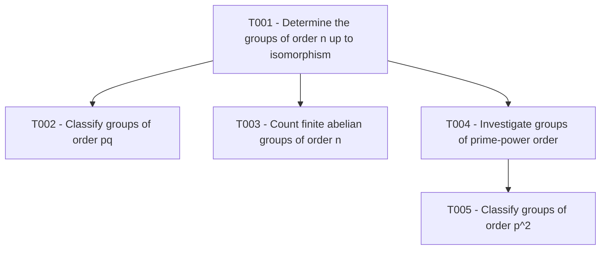

# Getting Started

This guide shows how to use the reconfigured Research Agent from an empty repository through the creation of the first child research task.

## 1. Connect GitHub

Connect the GitHub integration in ChatGPT and configure the ChatGPT connector in GitHub so it can access the repositories you want the Research Agent to read or edit.

Repository access is granted through that connector configuration. Access to one account or organization does not automatically imply access to every repository; the connector must be configured for the intended repositories.

## 2. Configure the Research Agent

Use [`RESEARCH_AGENT.md`](RESEARCH_AGENT.md) as the persistent instruction set for the research collaborator. This can be placed in the instructions of the GPT/agent configuration you use for research, or explicitly supplied at the start of a session when no persistent configuration is being used.

The Agent contains general research behavior only. It does not contain the state or exact rules of a particular research project.

## 3. Install the Skills

Install the standalone Skill packages under [`skills/`](skills/) independently:

- `bootstrap-research-project`
- `define-research-task`
- `transcribe-research-evidence`
- `complete-research-task`
- `validate-research-project`

Skills provide repeatable procedures. When a Skill operates on a project repository, it first reads that project's own `AGENTS.md` and follows the local rules there.

## 4. Bootstrap a project

A concise initialization request is:

```text
Initialize <OWNER>/<REPOSITORY> as a Research-Agent project around the question:
"<ROOT RESEARCH QUESTION>"

Use <SUPPLIED PAPER / NOTES / SOURCES> as background.
```

For example:

```text
Initialize <OWNER>/<REPOSITORY> as a Research-Agent project around the question:
"What are the different groups of order n up to isomorphism?"
```

The bootstrap Skill creates the project-local `AGENTS.md`, dictionary, roadmap, task templates, validation checklist, and the root task `T001`.

The root task represents the overarching research question. It does not need to be marked resolved before child tasks are created.

## 5. Understand what is now persistent

After bootstrap, the target repository rather than model memory stores the research state.

The most important authorities are:

- `AGENTS.md` for local project rules;
- `dictionary.md` for terminology and notation;
- `roadmap.yaml` for canonical roadmap state;
- `ROADMAP.md` for the visual roadmap;
- `Tasks/` for task contracts, evidence, and resolutions; and
- `Background/` for shared foundations.

When a later conversation resumes work on the project, the Agent should read the repository instead of relying on remembered state.

## 6. Choose a first branch

The user can ask:

```text
What is a good starting point for branching from T001?
```

The Agent may suggest options, but suggestions are not automatically tasks.

For the example root question about groups of order `n`, useful possibilities might include prime order, prime-square order, order `pq`, finite abelian groups, or a computational census for small `n`.

## 7. Start the task-definition conversation

Once a direction looks useful, say:

```text
Let's create a task for that direction. Start the task-definition conversation.
```

The `define-research-task` Skill begins with:

> What concrete action and bounded target should this task have?

The user can answer naturally. For example:

> I want to start understanding the classification by looking at groups whose order is the product of two distinct primes.

The conversation then narrows the task one decision at a time.

## 8. Example intake

A possible sequence is:

> **Agent:** Should this be a direct child of T001, studying one manageable family of values of `n`?
>
> **User:** Yes.

> **Agent:** Should the setting be `|G| = pq` for distinct primes `p < q`?
>
> **User:** Yes.

> **Agent:** Do you want examples, or a proof that the classification is complete?
>
> **User:** I want the complete classification with a proof.

> **Agent:** Should the argument be organized from Sylow theory and semidirect products?
>
> **User:** Yes, but I want the proof obligations explained rather than merely citing the classification.

At this point the task can be made precise without the model actually carrying out the proof.

## 9. Publish the task

When the scope is settled, say:

```text
Create the task with that scope.
```

The task-definition Skill then:

- allocates the next stable ID;
- creates the canonical task folder;
- writes `task-graph.md`;
- keeps `resolution.md` explicitly pending;
- updates `roadmap.yaml` and `ROADMAP.md`;
- records history when project rules require it; and
- validates the change before publishing it.

The task plan is a research contract, not authorization to solve the task autonomously.

## 10. Work on the task conversationally

A normal continuation is:

```text
Work with me on T002. For this turn, let's start with what Sylow theory forces about the q-Sylow subgroup.
```

The Agent should answer that bounded question, state what was established, and return control at the next meaningful decision point.

Later turns can be as small as:

```text
Can we prove the p-Sylow subgroup is normal in this case?
```

or:

```text
Before we use semidirect products, explain why that viewpoint is necessary here.
```

or:

```text
Scrutinize the argument we have so far and look for gaps.
```

The repository allows the conversation to stay narrow because task state and evidence are persistent.

## 11. Preserve important evidence

When a useful result has been established, preserve it separately from the decision about what it proves for the whole task.

For example:

```text
Transcribe the proof we just established as evidence for T002.
Save it as notes/sylow-q-normality.md.
```

The transcription Skill checks the dictionary, preserves the supplied content faithfully, writes only the requested evidence file, verifies it, and stops. It does not update the roadmap or complete the task.

## 12. Complete only when explicitly requested

When the accumulated evidence appears sufficient, the Agent may say that the task looks ready for completion. It should not complete it automatically.

The user can then request:

```text
Evaluate T002 for completion and complete it if the evidence supports an outcome.
```

The completion Skill verifies the original question, dependencies, evidence, proof scope, and project rules before writing the canonical `resolution.md` and changing lifecycle state.

Negative and inconclusive outcomes are valid completion outcomes when supported by the evidence.

## Example roadmap growth

The roadmap should grow from actual research decisions rather than from a prewritten solution plan. A later state might look like:



Only create those later nodes when a user-directed task-definition conversation actually reaches them.

## Mental model

Keep the three layers distinct:

```text
Research Agent
    = how the collaborator behaves

Research Skills
    = how repeatable operations are performed

Project repository
    = what this project currently knows and requires
```

That separation is the main architectural change in this version of Research-Agent.
