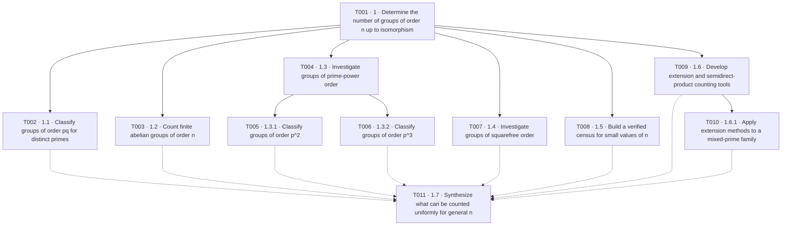

# Starting a Research Project and Defining the First Child Task

## 1. Initialization prompt

A user can start by giving the agent the repository, the broad research question, the Research-Agent to follow, and any initial background material.

For example:

> Use this agent (`https://github.com/AidanRDonahue/Research-Agent`) to set up a research project around the question:
>
> **“What are the different groups of order `n` up to isomorphism?”**
>
> Set it up in `<OWNER>/<REPOSITORY>` and use the material I provided as the initial background.
>
> Follow the instructions in the agent documents and copy the agent into the project.

This gives the agent four important pieces of information:

- **Agent authority:** which workflow governs the research project.
- **Repository:** where the persistent project should live.
- **Root question:** the broad mathematical question.
- **Background:** any initial notes, papers, textbooks, or other sources.

The project is then initialized with a root task, `T001`, corresponding to:

> **What are the different groups of order `n` up to isomorphism?**

This is intentionally broad. The goal of the next conversation is not to solve the classification problem for every `n`, but to identify a useful first branch.

---

## 2. Starting the first child-task conversation

The agent begins with:

> **Agent:** What concrete action and bounded target should this task have?
>
> **User:** I want to start understanding the classification by looking at some simple families of orders.

The agent should now help turn that general interest into a precise mathematical problem.

---

## 3. Establish where the task belongs

> **Agent:** Should this be a direct child of T001, with the goal of classifying groups for one manageable family of values of `n`?
>
> **User:** Yes, that sounds right.

This makes the new task one bounded contribution to the larger classification question.

---

## 4. Choose a manageable family of orders

The agent can suggest several natural starting points: prime order, prime-square order, products of two distinct primes, or small concrete values of `n`.

> **User:** Let’s look at groups whose order is the product of two distinct primes.

That already narrows the problem substantially.

---

## 5. Fix the exact setting

> **Agent:** Should we take `|G| = pq`, where `p < q` are distinct primes, and try to classify all such groups up to isomorphism?
>
> **User:** Yes.

Now the child task has a precise domain.

---

## 6. Decide whether the task should just list examples or prove the classification

The agent should clarify whether the user wants a survey of known possibilities or a complete theorem.

> **Agent:** Do you want to compare examples of groups of order `pq`, or actually prove that the classification is complete?
>
> **User:** I want the full classification. If we say those are all the possibilities, I want a proof.

This sets the standard of evidence.

The task should not stop after finding some examples. It must prove that no other isomorphism types can occur.

---

## 7. Identify the structure that will drive the proof

A natural next question is what tools should organize the classification.

> **Agent:** Should we build the argument from the Sylow theorems and then use semidirect products to describe the nonabelian case?
>
> **User:** Yes. I’d like to understand why those tools give the complete answer, not just quote the classification.

This gives the task a clear method without yet carrying out the proof.

---

## 8. Sharpen the theorem target

The agent can now formulate the expected theorem carefully:

> **Agent:** So should the target be to prove that for distinct primes `p < q`:
>
> - if `p` does not divide `q - 1`, every group of order `pq` is cyclic; and
> - if `p` divides `q - 1`, there are exactly two groups up to isomorphism: the cyclic group and one nonabelian semidirect product?
>
> **User:** Yes, that’s exactly what I want to investigate.

At this point, the broad interest has become a concrete theorem-level task.

---

## 9. Make the proof obligations explicit

The proof should not simply state the classification theorem. It should explain why each step is forced.

The task should establish, for example:

- what the Sylow theorems imply about the numbers of Sylow `p`- and `q`-subgroups;
- why the Sylow `q`-subgroup is normal;
- when the Sylow `p`-subgroup is also normal;
- why normality of both Sylow subgroups forces the group to be cyclic;
- how a nontrivial action `C_p -> Aut(C_q)` can exist exactly when `p` divides `q - 1`;
- why the resulting semidirect product is nonabelian; and
- why all nontrivial actions produce the same isomorphism type in this setting.

The agent can summarize this conversationally:

> **Agent:** Then the first task will be to prove the classification from Sylow theory and semidirect products, including why the nonabelian group exists exactly in the `p | (q - 1)` case and why there aren’t any additional isomorphism types.
>
> **User:** Yes, that seems like a good first task.

---

# Resulting First Child Task

## Research question

> **What are the groups of order `pq`, for distinct primes `p < q`, up to isomorphism?**

## Relationship to the root task

The task is a direct child of `T001`:

> **What are the different groups of order `n` up to isomorphism?**

It studies one tractable family of orders and provides a complete classification theorem that can serve as a model for later branches.

## Theorem target

Let `p < q` be distinct primes and let `G` be a group of order `|G| = pq`.

Prove the complete classification:

- if `p` does not divide `q - 1`, then `G` is isomorphic to the cyclic group `C_pq`;
- if `p` divides `q - 1`, then there are exactly two isomorphism classes: `C_pq` and a nonabelian semidirect product `C_q ⋊ C_p`.

## Required proof obligations

The task should prove rather than merely cite:

- the relevant Sylow-subgroup counts;
- normality of the Sylow `q`-subgroup;
- the consequences when both Sylow subgroups are normal;
- the structure of `Aut(C_q) ≅ C_{q-1}`;
- the existence criterion for a nontrivial homomorphism `C_p -> Aut(C_q)`;
- construction of the nonabelian semidirect product;
- completeness of the classification; and
- uniqueness, up to isomorphism, of the nonabelian group when it exists.

Only after that classification is established should the project move to another family of orders.

---

# General Pattern for Users

The overall workflow is:

**Initialization prompt → broad root task `T001` → narrowing conversation → precise child task → guided proof.**

The user does not need to formulate the task in formal research language. Normal responses are enough:

> “I want to start with an easier family of cases.”

> “Let’s look at orders that are products of two primes.”

> “I want the full classification, not just examples.”

> “Use Sylow theory, but I want to understand the proof.”

> “Yes, that seems like a good first task.”

The agent’s role is to turn those ordinary mathematical choices into a rigorous, bounded task contract while preserving the user’s actual research direction.

---

# Example Roadmap After Several Research Conversations

The first child task does not need to determine the entire future roadmap. New nodes should normally be created only when a later conversation identifies a concrete bounded question. Over time, however, a project asking

> **How many groups of order `n` are there up to isomorphism?**

might grow into a roadmap like the following.

This is only an illustrative roadmap. `T001` and `T002` match the example developed above; the later nodes are hypothetical examples of branches that could be added after separate task-intake conversations.

In this sketch, the solid arrows represent conceptual parent-child relationships, while the dotted arrows show examples of information that could feed a later synthesis task. In a real project, dependency edges should be recorded in `roadmap.yaml` only when the corresponding prerequisite relationship has actually been established.

The key is that the roadmap should remain a map of the research, not a solution written in advance. Broad tasks can branch naturally as new questions and useful directions emerge. Once enough of those branches are complete, the results can be combined into a paper whose structure follows the roadmap. This is especially useful for telling a "story" where multiple conjectures were resolved during the research process. 

The branches that do not end up contributing directly to that synthesis are still valuable: they provide natural starting points for follow-up papers and future research.
