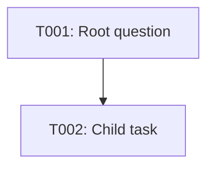

# Research Project Template

Use this reference when bootstrapping a target repository. Replace angle-bracket placeholders with user-supplied project information and preserve existing compatible project artifacts.

## Canonical top-level structure

```text
<Project>/
|-- README.md
|-- AGENTS.md
|-- dictionary.md
|-- roadmap.yaml
|-- ROADMAP.md
|-- research-agent.lock.json    # when concrete distribution metadata is available
|-- Tasks/
|   |-- README.md
|   `-- T001-<root-slug>/
|       |-- Background/
|       |-- task-graph.md
|       `-- resolution.md
|-- templates/
|   |-- task-graph.md
|   `-- resolution.md
|-- history/
|   `-- roadmap-events.jsonl
|-- checks/
|   `-- project-system-checklist.md
`-- <project-specific artifacts>
```

## Project-local AGENTS.md baseline

The target repository's `AGENTS.md` should define local authority and state conventions, not the general Research Agent personality and not a manual module-routing table.

At minimum record:

- repository state is authoritative over model memory;
- authority order: `AGENTS.md`, `dictionary.md`, current research artifacts, `roadmap.yaml`, `ROADMAP.md`, append-only history;
- `dictionary.md` is the notation/terminology authority;
- `roadmap.yaml` is canonical structured roadmap state;
- `ROADMAP.md` is its Mermaid projection, and every task node includes a clickable hyperlink to the task's canonical GitHub folder;
- node-scoped context normally includes only the current task, its parent, declared dependencies, required cross-links, and directly relevant task-local evidence;
- every task has exactly one canonical `Tasks/<STABLE-ID>-<slug>/` folder containing `task-graph.md` and a pending-or-completed `resolution.md`;
- `Tasks/T001-<root-slug>/Background/` is the canonical location for project-global background material; do not create a separate top-level `Background/` directory;
- stable IDs are monotone and never reused; new `display_index` values default to the stable ID unless the user or project specifies otherwise;
- every non-root task has exactly one conceptual parent and parent/dependency graphs are acyclic;
- task evidence remains task-local unless it genuinely functions as project-global background, in which case it belongs under T001's `Background/` directory;
- ordinary task work is user-directed and does not authorize autonomous completion;
- project-authored mathematical operations use `\mathrm{...}` rather than `\operatorname{...}` unless the dictionary records another convention;
- `research-agent.lock.json`, when present, records external toolchain compatibility and never overrides project-local research authority; and
- substantive repository mutations use a scoped branch and reviewable pull request unless the user explicitly authorizes another write path.

## Toolchain lock

When the installed bootstrap Skill exposes concrete generated `DISTRIBUTION.json` metadata, create `research-agent.lock.json` with schema version 1 and record:

- Research-Agent source repository;
- release version;
- release tag;
- exact source commit; and
- the core Skills the project expects to use.

If concrete distribution metadata is unavailable, do not guess or infer a version/commit from memory. The project may remain temporarily unpinned; report that limitation so the user can create the lock from the release's `research-agent-distribution.json` later.

The lock is deployment/compatibility metadata. It does not change the authority order for research state.

## Root task

Create `T001` for the overarching research question. It may remain unresolved while child tasks are defined.

Create `Tasks/T001-<root-slug>/Background/` for material whose role is genuinely global to the research project, including supplied papers, common reference notes, or shared foundations that are not specific to a child task. Global background remains source/background material rather than established project results unless separately supported by research evidence.

A new task folder uses the project template for `task-graph.md` and `resolution.md`. The root `resolution.md` begins with an explicit pending notice and must not imply that the overarching question is solved.

## Task contract baseline

A `task-graph.md` should record:

- stable ID and display index;
- title, type, and status;
- conceptual parent (except root);
- relation to parent and effect on parent;
- uncertainty reduced / question answered;
- exact dependencies and cross-links;
- objective;
- included and excluded scope;
- assumptions and conventions;
- bounded method;
- stopping rules;
- success, negative, and realistic inconclusive branches;
- independent validation; and
- a Mermaid result-dependency graph based on actual evidence/results rather than generic process steps.

## Roadmap baseline

`roadmap.yaml` is the canonical structured state. `ROADMAP.md` should be only the human-readable/visual projection required by the project, normally a Mermaid graph.

Every Mermaid task node must be clickable and link to that task's canonical GitHub folder. Use Mermaid `click` directives with absolute GitHub URLs derived from the target repository and its default branch, for example:



Do not leave any task node without its corresponding `click` directive. Do not prewrite future branches. Initialize only `T001` unless the user has explicitly authorized additional tasks.

## Validation baseline

Create `checks/project-system-checklist.md` covering at least:

- required files/directories;
- roadmap/task agreement;
- every Mermaid roadmap task node has a valid GitHub hyperlink to its canonical task folder;
- `Tasks/T001-<root-slug>/Background/` is the canonical project-global background location and no separate top-level `Background/` is introduced;
- unique monotone stable IDs;
- parent/dependency validity and acyclicity;
- one canonical folder per task;
- required task files;
- pending versus completed resolution state;
- evidence/result graph consistency;
- referenced evidence existence;
- terminology and notation consistency;
- append-only history validity;
- Research-Agent lock validity when the project uses a compatibility pin; and
- repository-specific tests or CI when applicable.
